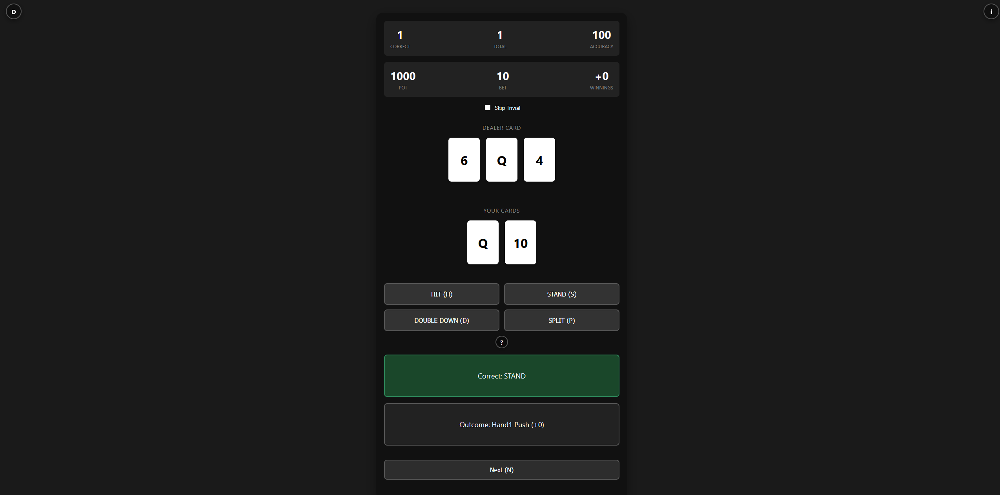

# Blackjack Buddy

Blackjack decision assistant implementing basic strategy. Minimal Go HTTP server with an embedded Svelte UI training module.



## Features

- Matrix-based strategy lookup with advisor
- Embedded web trainer with round simulation
- Supports hard, soft, doubles, and splits
- Finite multi-deck shoe with card tracking and reshuffling
- Winnings tracking with pot, bet, and round outcomes
- TypeScript-based Svelte UI with component architecture

## Quick Start

**Requirements:** Go 1.25.1+, Make, Node 18+

```bash
git clone https://github.com/bryan/blackjack-buddy.git
cd blackjack-buddy
make build
```

## Usage

```bash
./blackjack-buddy [-port=8080] [-strategy=basic]
```

The binary hosts the HTTP API and embedded trainer UI. Strategy flag accepts any value from `internal/strategy/strategies` (e.g., `basic`, `coward`).

## Development

- `make ui-build` — rebuild the Svelte UI only
- `make api-build` — compile the Go server only
- `make run` — build everything then start the server

## Structure

- `api/` — HTTP server, handlers, helpers, embedded assets
- `internal/` — internal packages intended to be shared amongst layers
- `web/` — TypeScript Svelte trainer UI with components